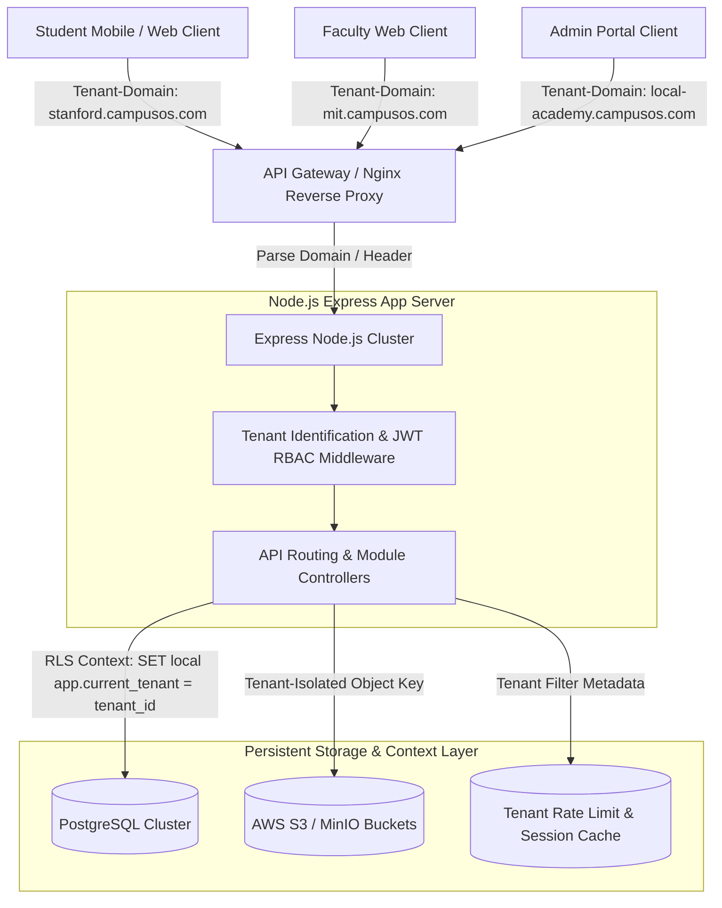
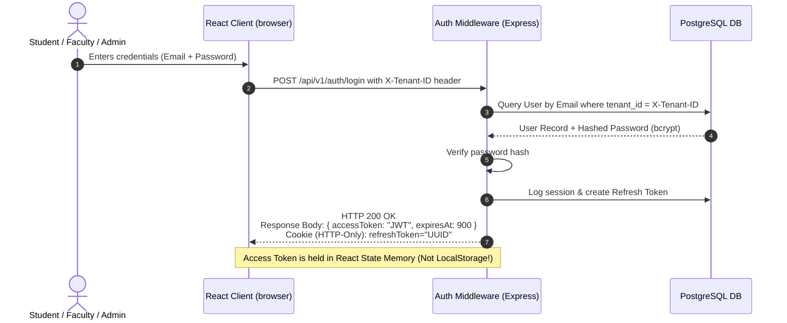
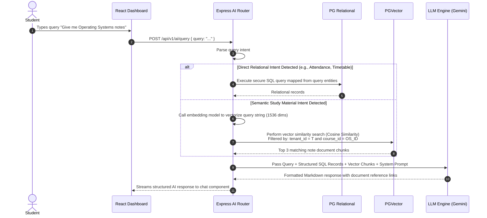

# CampusOS – System Architecture Blueprint

This document defines the production-grade, multi-tenant system architecture, secure data boundary models, and comprehensive application flow topology for CampusOS.

---

## 🏗️ Multi-Tenant SaaS Architecture

CampusOS is designed to support thousands of distinct educational institutions (tenants) within a single deployable SaaS infrastructure. Security, data isolation, and low operational overhead are achieved using a **Shared Database, Shared Schema with Row-Level Security (RLS)** as the primary model, while maintaining support for **Schema-per-Tenant** for enterprise universities.



### 1. Tenant Identification Mechanism
Tenants are dynamically identified through two primary methods:
1. **Subdomain Matching**: A request to `mit.campusos.com` or `custom-domain.edu` is intercepted by the Nginx reverse proxy, which injects the `X-Tenant-Domain` header.
2. **API Path/Header**: Direct mobile client calls pass `X-Tenant-ID` in the request header.

### 2. Row-Level Security (RLS) Implementation in PostgreSQL
To prevent cross-tenant data leakage, the database enforces RLS. Every table contains a `tenant_id` UUID column. When a backend connection is pulled from the pool, it runs an initialization query inside a transaction:

```sql
-- Establish tenant context inside the active connection transaction
SET LOCAL app.current_tenant = '8f3e0984-7a3b-489e-b9ef-d4de20e17b88';
```

PostgreSQL automatically evaluates policies on each table before returning or modifying records:

```sql
-- Example RLS policy for Student timetables
CREATE POLICY tenant_isolation_policy ON timetables
    USING (tenant_id = NULLIF(current_setting('app.current_tenant', true), '')::uuid);
```

---

## 🔒 Security, Authentication, & Role-Based Access Control (RBAC)

### 1. Core Token Authentication Flow
CampusOS uses short-lived JSON Web Tokens (JWT) for authentication alongside HTTP-Only, Secure, SameSite-Strict refresh cookies to mitigate Cross-Site Scripting (XSS) and Cross-Site Request Forgery (CSRF).



### 2. Dynamic RBAC Middleware
Access permissions are strictly role-based and mapped inside JWT claims:
* **Students**: Can view personal attendance, personal timetable, registered clubs, and download study materials. Write access limited to lost & found reports, resource bookings (subject to limits), and personal complaints.
* **Faculty**: Full read/write access over classes, attendance logging, course notes uploading, assignments creation, and student list viewing within their designated departments.
* **Administrators**: Complete CRUD access over institute catalogs, faculty assignments, tenant configuration, and comprehensive system reports.

#### Express RBAC Guard Handler Pattern
```javascript
// Express custom middleware to check permissions dynamically
const authorizeRoles = (...allowedRoles) => {
  return (req, res, next) => {
    const userRole = req.user.role; // Parsed from JWT payload
    if (!allowedRoles.includes(userRole)) {
      return res.status(403).json({ 
        success: false, 
        message: "Forbidden: Insufficient privileges for this operation." 
      });
    }
    next();
  };
};

// Usage in routing
router.post('/assignments', authorizeRoles('faculty', 'admin'), createAssignmentController);
```

---

## 🔄 Core Request-Response Lifecycles

### 1. Relational Query Path (e.g., Timetable Lookup)
1. **Client GET** `/api/v1/timetable/today` containing JWT in the `Authorization` header.
2. **Nginx** validates the request formatting and routes it to the active Express server cluster.
3. **Auth Middleware** verifies the JWT signature, extracts `userId`, `role`, and `tenantId`.
4. **Tenant Middleware** leases a PostgreSQL client from the pool and sets the connection-level transaction configuration `SET LOCAL app.current_tenant = tenantId`.
5. **Controller** executes a parameterized SQL SELECT query:
   ```sql
   SELECT * FROM timetables WHERE class_id = $1 AND day_of_week = $2;
   ```
6. **PostgreSQL** enforces RLS, restricts records to the active `tenantId`, filters by query params, and returns JSON array.
7. **Express** sends the data with a compression layer (gzip) back to the client.

### 2. Hybrid AI Query Path (e.g., "Give me operating systems notes")


---

## 📈 Scalable Network & Microservices Topology

In large university groups, standard monolothic Express setups choke. CampusOS operates an event-driven cluster:
* **Redis Pub/Sub**: Synchronizes real-time chat messages, active lab occupancy tickers, and booking alerts across separate Node.js server pods.
* **BullMQ (Redis-backed queue)**: Offloads heavy computation tasks, such as PDF parsing, embedding generation, automatic email alerts for attendance warnings, and CSV report compiling.
