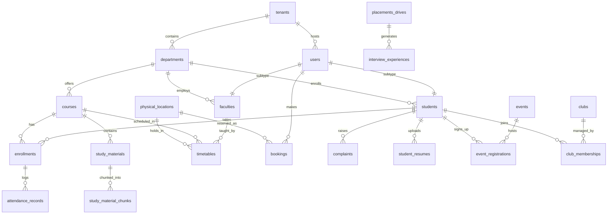

# CampusOS – Database Design Specification

This document details the production-grade PostgreSQL database schema designed for the multi-tenant SaaS architecture. It leverages the standard relational structures alongside the `pgvector` extension for semantic AI storage and matching algorithms.

---

## 📊 Entity Relationship Diagram (ERD)



---

## 💾 Core Schema Definition (DDL SQL)

To configure `pgvector`, ensure you run the initialization statement at the database boot tier:
```sql
CREATE EXTENSION IF NOT EXISTS "uuid-ossp";
CREATE EXTENSION IF NOT EXISTS "vector"; -- Enables the 1536-dimensional OpenAI/Gemini embedding vector type
```

### 1. Tenant & Identity Tier
```sql
-- 1. Tenant Table
CREATE TABLE tenants (
    id UUID PRIMARY KEY DEFAULT uuid_generate_v4(),
    domain_name VARCHAR(255) UNIQUE NOT NULL,
    institution_name VARCHAR(255) NOT NULL,
    tier VARCHAR(50) DEFAULT 'standard' CHECK (tier IN ('standard', 'enterprise', 'demo')),
    branding_config JSONB DEFAULT '{}'::jsonb,
    created_at TIMESTAMP WITH TIME ZONE DEFAULT CURRENT_TIMESTAMP
);

-- 2. Base Users Table (Identity Storage)
CREATE TABLE users (
    id UUID PRIMARY KEY DEFAULT uuid_generate_v4(),
    tenant_id UUID NOT NULL REFERENCES tenants(id) ON DELETE CASCADE,
    email VARCHAR(255) NOT NULL,
    password_hash VARCHAR(255) NOT NULL,
    role VARCHAR(50) NOT NULL CHECK (role IN ('student', 'faculty', 'admin')),
    first_name VARCHAR(100) NOT NULL,
    last_name VARCHAR(100) NOT NULL,
    phone_number VARCHAR(20),
    avatar_url VARCHAR(512),
    created_at TIMESTAMP WITH TIME ZONE DEFAULT CURRENT_TIMESTAMP,
    updated_at TIMESTAMP WITH TIME ZONE DEFAULT CURRENT_TIMESTAMP,
    CONSTRAINT unique_tenant_email UNIQUE (tenant_id, email)
);
```

### 2. Academic Core
```sql
-- 3. Departments
CREATE TABLE departments (
    id UUID PRIMARY KEY DEFAULT uuid_generate_v4(),
    tenant_id UUID NOT NULL REFERENCES tenants(id) ON DELETE CASCADE,
    name VARCHAR(255) NOT NULL,
    code VARCHAR(50) NOT NULL,
    hod_id UUID, -- Managed via dynamic trigger/referential update (cyclic avoidance)
    created_at TIMESTAMP WITH TIME ZONE DEFAULT CURRENT_TIMESTAMP,
    CONSTRAINT unique_tenant_dept_code UNIQUE (tenant_id, code)
);

-- 4. Faculty Profiles
CREATE TABLE faculties (
    user_id UUID PRIMARY KEY REFERENCES users(id) ON DELETE CASCADE,
    tenant_id UUID NOT NULL REFERENCES tenants(id) ON DELETE CASCADE,
    dept_id UUID NOT NULL REFERENCES departments(id),
    employee_id VARCHAR(50) NOT NULL,
    designation VARCHAR(100),
    office_room VARCHAR(50),
    skills VARCHAR(255)[] DEFAULT '{}'::varchar[],
    CONSTRAINT unique_tenant_emp_id UNIQUE (tenant_id, employee_id)
);

-- 5. Student Profiles
CREATE TABLE students (
    user_id UUID PRIMARY KEY REFERENCES users(id) ON DELETE CASCADE,
    tenant_id UUID NOT NULL REFERENCES tenants(id) ON DELETE CASCADE,
    dept_id UUID NOT NULL REFERENCES departments(id),
    roll_no VARCHAR(50) NOT NULL,
    current_semester INT NOT NULL DEFAULT 1 CHECK (current_semester BETWEEN 1 AND 10),
    batch VARCHAR(20) NOT NULL, -- e.g., '2023-2027'
    gpa NUMERIC(4, 2) DEFAULT 0.00 CHECK (gpa BETWEEN 0.00 AND 10.00),
    skills_inventory VARCHAR(255)[] DEFAULT '{}'::varchar[],
    academic_status VARCHAR(50) DEFAULT 'active' CHECK (academic_status IN ('active', 'on_leave', 'probation', 'graduated')),
    CONSTRAINT unique_tenant_roll_no UNIQUE (tenant_id, roll_no)
);

-- 6. Courses Catalog
CREATE TABLE courses (
    id UUID PRIMARY KEY DEFAULT uuid_generate_v4(),
    tenant_id UUID NOT NULL REFERENCES tenants(id) ON DELETE CASCADE,
    dept_id UUID NOT NULL REFERENCES departments(id),
    code VARCHAR(50) NOT NULL,
    name VARCHAR(255) NOT NULL,
    credits INT NOT NULL CHECK (credits BETWEEN 1 AND 6),
    description TEXT,
    CONSTRAINT unique_tenant_course_code UNIQUE (tenant_id, code)
);

-- 7. Student Enrollments
CREATE TABLE enrollments (
    id UUID PRIMARY KEY DEFAULT uuid_generate_v4(),
    tenant_id UUID NOT NULL REFERENCES tenants(id) ON DELETE CASCADE,
    student_id UUID NOT NULL REFERENCES students(user_id) ON DELETE CASCADE,
    course_id UUID NOT NULL REFERENCES courses(id) ON DELETE CASCADE,
    semester INT NOT NULL,
    grade VARCHAR(2), -- Nullable until graded
    attendance_ratio NUMERIC(5, 2) DEFAULT 100.00 CHECK (attendance_ratio BETWEEN 0.00 AND 100.00),
    CONSTRAINT unique_student_course_semester UNIQUE (student_id, course_id, semester)
);
```

### 3. Wayfinding & Resource Booking
```sql
-- 8. Campus Physical Map Locations
CREATE TABLE physical_locations (
    id UUID PRIMARY KEY DEFAULT uuid_generate_v4(),
    tenant_id UUID NOT NULL REFERENCES tenants(id) ON DELETE CASCADE,
    name VARCHAR(100) NOT NULL,
    location_type VARCHAR(50) NOT NULL CHECK (location_type IN ('classroom', 'laboratory', 'seminar_hall', 'office', 'auditorium', 'library')),
    building_name VARCHAR(100) NOT NULL,
    floor INT NOT NULL,
    room_number VARCHAR(20) NOT NULL,
    geo_coordinates JSONB NOT NULL, -- Format: { x: pixelX, y: pixelY, lat: X, lng: Y }
    qr_code_uuid UUID UNIQUE DEFAULT uuid_generate_v4(),
    is_currently_free BOOLEAN NOT NULL DEFAULT true,
    CONSTRAINT unique_tenant_room UNIQUE (tenant_id, building_name, room_number)
);

-- 9. Timetable Matrix
CREATE TABLE timetables (
    id UUID PRIMARY KEY DEFAULT uuid_generate_v4(),
    tenant_id UUID NOT NULL REFERENCES tenants(id) ON DELETE CASCADE,
    course_id UUID NOT NULL REFERENCES courses(id) ON DELETE CASCADE,
    faculty_id UUID NOT NULL REFERENCES faculties(user_id),
    location_id UUID NOT NULL REFERENCES physical_locations(id),
    day_of_week VARCHAR(15) NOT NULL CHECK (day_of_week IN ('Monday', 'Tuesday', 'Wednesday', 'Thursday', 'Friday', 'Saturday', 'Sunday')),
    start_time TIME NOT NULL,
    end_time TIME NOT NULL,
    semester INT NOT NULL,
    section_code VARCHAR(10) NOT NULL, -- e.g., 'A', 'B'
    CONSTRAINT time_slot_sanity CHECK (start_time < end_time)
);

-- 10. Bookings Ledger
CREATE TABLE bookings (
    id UUID PRIMARY KEY DEFAULT uuid_generate_v4(),
    tenant_id UUID NOT NULL REFERENCES tenants(id) ON DELETE CASCADE,
    resource_id UUID NOT NULL REFERENCES physical_locations(id) ON DELETE CASCADE,
    booked_by UUID NOT NULL REFERENCES users(id) ON DELETE CASCADE,
    start_time TIMESTAMP WITH TIME ZONE NOT NULL,
    end_time TIMESTAMP WITH TIME ZONE NOT NULL,
    purpose TEXT NOT NULL,
    status VARCHAR(50) DEFAULT 'pending' CHECK (status IN ('pending', 'approved', 'rejected', 'cancelled')),
    created_at TIMESTAMP WITH TIME ZONE DEFAULT CURRENT_TIMESTAMP,
    CONSTRAINT booking_time_sanity CHECK (start_time < end_time)
);
```

### 4. Academics Operations & RAG Storage
```sql
-- 11. Study Materials Metadata
CREATE TABLE study_materials (
    id UUID PRIMARY KEY DEFAULT uuid_generate_v4(),
    tenant_id UUID NOT NULL REFERENCES tenants(id) ON DELETE CASCADE,
    course_id UUID NOT NULL REFERENCES courses(id) ON DELETE CASCADE,
    uploaded_by UUID NOT NULL REFERENCES faculties(user_id) ON DELETE CASCADE,
    title VARCHAR(255) NOT NULL,
    s3_key VARCHAR(512) NOT NULL,
    file_type VARCHAR(20) NOT NULL, -- 'pdf', 'docx', 'pptx'
    file_size INT NOT NULL, -- in bytes
    created_at TIMESTAMP WITH TIME ZONE DEFAULT CURRENT_TIMESTAMP
);

-- 12. Vector Chunk Store (RAG Engine Core)
CREATE TABLE study_material_chunks (
    id UUID PRIMARY KEY DEFAULT uuid_generate_v4(),
    tenant_id UUID NOT NULL REFERENCES tenants(id) ON DELETE CASCADE,
    material_id UUID NOT NULL REFERENCES study_materials(id) ON DELETE CASCADE,
    chunk_index INT NOT NULL,
    content_text TEXT NOT NULL,
    embedding vector(1536) NOT NULL -- pgvector column size mapped to text-embedding-3
);

-- 13. Attendance Tracker
CREATE TABLE attendance_records (
    id UUID PRIMARY KEY DEFAULT uuid_generate_v4(),
    tenant_id UUID NOT NULL REFERENCES tenants(id) ON DELETE CASCADE,
    enrollment_id UUID NOT NULL REFERENCES enrollments(id) ON DELETE CASCADE,
    timetable_id UUID NOT NULL REFERENCES timetables(id) ON DELETE CASCADE,
    date DATE NOT NULL DEFAULT CURRENT_DATE,
    status VARCHAR(15) NOT NULL CHECK (status IN ('present', 'absent', 'late')),
    remarks TEXT
);

-- 14. Assignments
CREATE TABLE assignments (
    id UUID PRIMARY KEY DEFAULT uuid_generate_v4(),
    tenant_id UUID NOT NULL REFERENCES tenants(id) ON DELETE CASCADE,
    course_id UUID NOT NULL REFERENCES courses(id) ON DELETE CASCADE,
    faculty_id UUID NOT NULL REFERENCES faculties(user_id) ON DELETE CASCADE,
    title VARCHAR(255) NOT NULL,
    description TEXT,
    max_marks INT NOT NULL CHECK (max_marks > 0),
    due_date TIMESTAMP WITH TIME ZONE NOT NULL,
    created_at TIMESTAMP WITH TIME ZONE DEFAULT CURRENT_TIMESTAMP
);

-- 15. Student Submissions
CREATE TABLE submissions (
    id UUID PRIMARY KEY DEFAULT uuid_generate_v4(),
    tenant_id UUID NOT NULL REFERENCES tenants(id) ON DELETE CASCADE,
    assignment_id UUID NOT NULL REFERENCES assignments(id) ON DELETE CASCADE,
    student_id UUID NOT NULL REFERENCES students(user_id) ON DELETE CASCADE,
    submission_text TEXT,
    file_s3_key VARCHAR(512),
    submitted_at TIMESTAMP WITH TIME ZONE DEFAULT CURRENT_TIMESTAMP,
    marks_obtained NUMERIC(5, 2),
    faculty_feedback TEXT,
    status VARCHAR(20) DEFAULT 'submitted' CHECK (status IN ('submitted', 'late', 'graded')),
    CONSTRAINT marks_sanity CHECK (marks_obtained <= (SELECT max_marks FROM assignments WHERE id = assignment_id))
);
```

### 5. Career & Placement Engine
```sql
-- 16. Career Placement Drives
CREATE TABLE placements_drives (
    id UUID PRIMARY KEY DEFAULT uuid_generate_v4(),
    tenant_id UUID NOT NULL REFERENCES tenants(id) ON DELETE CASCADE,
    company_name VARCHAR(255) NOT NULL,
    job_title VARCHAR(255) NOT NULL,
    eligibility_min_cgpa NUMERIC(4, 2) NOT NULL CHECK (eligibility_min_cgpa BETWEEN 0.00 AND 10.00),
    eligible_departments UUID[] NOT NULL DEFAULT '{}'::uuid[], -- Array of eligible department IDs
    salary_package VARCHAR(100), -- e.g., '12 LPA'
    open_date DATE NOT NULL,
    close_date DATE NOT NULL,
    exam_date DATE,
    job_description TEXT,
    created_at TIMESTAMP WITH TIME ZONE DEFAULT CURRENT_TIMESTAMP
);

-- 17. Student Resumes
CREATE TABLE student_resumes (
    id UUID PRIMARY KEY DEFAULT uuid_generate_v4(),
    tenant_id UUID NOT NULL REFERENCES tenants(id) ON DELETE CASCADE,
    student_id UUID NOT NULL REFERENCES students(user_id) ON DELETE CASCADE,
    s3_key VARCHAR(512) NOT NULL,
    parsed_skills VARCHAR(255)[] DEFAULT '{}'::varchar[],
    resume_text TEXT NOT NULL,
    resume_embedding vector(1536) NOT NULL, -- Used to map match index against job description
    uploaded_at TIMESTAMP WITH TIME ZONE DEFAULT CURRENT_TIMESTAMP
);

-- 18. Shared Interview Experiences
CREATE TABLE interview_experiences (
    id UUID PRIMARY KEY DEFAULT uuid_generate_v4(),
    tenant_id UUID NOT NULL REFERENCES tenants(id) ON DELETE CASCADE,
    student_id UUID NOT NULL REFERENCES students(user_id) ON DELETE CASCADE,
    company_name VARCHAR(255) NOT NULL,
    job_title VARCHAR(255) NOT NULL,
    experience_text TEXT NOT NULL,
    questions_list TEXT[],
    outcome VARCHAR(50) CHECK (outcome IN ('selected', 'rejected', 'pending_result')),
    created_at TIMESTAMP WITH TIME ZONE DEFAULT CURRENT_TIMESTAMP
);
```

### 6. Interactive Community, Feedback & Security Matcher
```sql
-- 19. Complaints Registry
CREATE TABLE complaints (
    id UUID PRIMARY KEY DEFAULT uuid_generate_v4(),
    tenant_id UUID NOT NULL REFERENCES tenants(id) ON DELETE CASCADE,
    raised_by UUID NOT NULL REFERENCES users(id) ON DELETE CASCADE,
    title VARCHAR(255) NOT NULL,
    category VARCHAR(100) NOT NULL CHECK (category IN ('academic', 'hostel', 'facility', 'billing', 'disciplinary', 'other')),
    description TEXT NOT NULL,
    status VARCHAR(50) DEFAULT 'open' CHECK (status IN ('open', 'in_progress', 'resolved')),
    assigned_admin UUID REFERENCES users(id),
    feedback_rating INT CHECK (feedback_rating BETWEEN 1 AND 5),
    created_at TIMESTAMP WITH TIME ZONE DEFAULT CURRENT_TIMESTAMP,
    updated_at TIMESTAMP WITH TIME ZONE DEFAULT CURRENT_TIMESTAMP
);

-- 20. Lost & Found Hub (Vector Matcher Enabled)
CREATE TABLE lost_found (
    id UUID PRIMARY KEY DEFAULT uuid_generate_v4(),
    tenant_id UUID NOT NULL REFERENCES tenants(id) ON DELETE CASCADE,
    reporter_id UUID NOT NULL REFERENCES users(id) ON DELETE CASCADE,
    report_type VARCHAR(10) NOT NULL CHECK (report_type IN ('lost', 'found')),
    item_name VARCHAR(255) NOT NULL,
    description TEXT NOT NULL,
    item_description_embedding vector(1536) NOT NULL, -- Cross-compare lost items with found items
    location_discovered VARCHAR(255),
    image_url VARCHAR(512),
    status VARCHAR(20) DEFAULT 'active' CHECK (status IN ('active', 'matching', 'claimed', 'resolved')),
    created_at TIMESTAMP WITH TIME ZONE DEFAULT CURRENT_TIMESTAMP
);

-- 21. Event Listings
CREATE TABLE events (
    id UUID PRIMARY KEY DEFAULT uuid_generate_v4(),
    tenant_id UUID NOT NULL REFERENCES tenants(id) ON DELETE CASCADE,
    title VARCHAR(255) NOT NULL,
    description TEXT,
    event_start TIMESTAMP WITH TIME ZONE NOT NULL,
    event_end TIMESTAMP WITH TIME ZONE NOT NULL,
    location_id UUID REFERENCES physical_locations(id) ON DELETE SET NULL,
    club_id UUID, -- Nullable if not organized by club
    department_id UUID REFERENCES departments(id) ON DELETE SET NULL,
    max_registrations INT,
    registration_deadline TIMESTAMP WITH TIME ZONE,
    created_at TIMESTAMP WITH TIME ZONE DEFAULT CURRENT_TIMESTAMP
);

-- 22. Event Registrations
CREATE TABLE event_registrations (
    id UUID PRIMARY KEY DEFAULT uuid_generate_v4(),
    student_id UUID NOT NULL REFERENCES students(user_id) ON DELETE CASCADE,
    event_id UUID NOT NULL REFERENCES events(id) ON DELETE CASCADE,
    registered_at TIMESTAMP WITH TIME ZONE DEFAULT CURRENT_TIMESTAMP,
    attendance_status VARCHAR(20) DEFAULT 'registered' CHECK (attendance_status IN ('registered', 'attended', 'no_show')),
    CONSTRAINT unique_student_event UNIQUE (student_id, event_id)
);

-- 23. Clubs and Societies
CREATE TABLE clubs (
    id UUID PRIMARY KEY DEFAULT uuid_generate_v4(),
    tenant_id UUID NOT NULL REFERENCES tenants(id) ON DELETE CASCADE,
    name VARCHAR(255) NOT NULL,
    description TEXT,
    lead_student_id UUID REFERENCES students(user_id) ON DELETE SET NULL,
    mentor_faculty_id UUID REFERENCES faculties(user_id) ON DELETE SET NULL,
    required_skills VARCHAR(100)[] DEFAULT '{}'::varchar[],
    created_at TIMESTAMP WITH TIME ZONE DEFAULT CURRENT_TIMESTAMP
);

-- 24. Club Memberships
CREATE TABLE club_memberships (
    id UUID PRIMARY KEY DEFAULT uuid_generate_v4(),
    student_id UUID NOT NULL REFERENCES students(user_id) ON DELETE CASCADE,
    club_id UUID NOT NULL REFERENCES clubs(id) ON DELETE CASCADE,
    role VARCHAR(50) DEFAULT 'member' CHECK (role IN ('member', 'coordinator', 'vice_president', 'president')),
    joined_at TIMESTAMP WITH TIME ZONE DEFAULT CURRENT_TIMESTAMP,
    CONSTRAINT unique_student_club UNIQUE (student_id, club_id)
);
```

---

## ⚡ Indexing & Performance Strategies

High concurrency across institutions requires specialized indexing paradigms to maintain sub-50ms query operations.

### 1. B-Tree Filtering Indexes
To speed up common tenant routing and RLS validations:
```sql
-- Indexes matching tenant scopes on critical entities
CREATE INDEX idx_users_tenant_role ON users(tenant_id, role);
CREATE INDEX idx_enrollments_student ON enrollments(student_id);
CREATE INDEX idx_timetables_slots ON timetables(tenant_id, day_of_week, start_time, end_time);
CREATE INDEX idx_attendance_lookup ON attendance_records(tenant_id, date, status);
CREATE INDEX idx_bookings_schedule ON bookings(resource_id, start_time, end_time) WHERE status = 'approved';
```

### 2. High-Performance HNSW (Hierarchical Navigable Small World) Vector Indices
Standard cosine similarity searches scan table contents (sequential scan), which chokes at scale. We register HNSW indices to offer rapid semantic retrieval on embeddings:
```sql
-- Indexing document RAG chunks
CREATE INDEX idx_study_chunks_vector ON study_material_chunks 
USING hnsw (embedding vector_cosine_ops);

-- Indexing resume vectors for placement similarity matching
CREATE INDEX idx_resumes_vector ON student_resumes 
USING hnsw (resume_embedding vector_cosine_ops);

-- Indexing lost and found descriptors
CREATE INDEX idx_lostfound_vector ON lost_found 
USING hnsw (item_description_embedding vector_cosine_ops);
```

### 3. Dynamic Database Triggers for Smart Calculations
To prevent costly on-the-fly aggregations of student performance and attendance risk ratings:
```sql
-- Automatically update enrollment attendance_ratio on record insertion
CREATE OR REPLACE FUNCTION update_enrollment_attendance()
RETURNS TRIGGER AS $$
DECLARE
    total_slots INT;
    present_slots INT;
    new_ratio NUMERIC(5,2);
BEGIN
    -- Count all recorded timetable slots for this enrollment
    SELECT COUNT(*), COUNT(*) FILTER (WHERE status IN ('present', 'late'))
    INTO total_slots, present_slots
    FROM attendance_records
    WHERE enrollment_id = NEW.enrollment_id;

    IF total_slots > 0 THEN
        new_ratio := (present_slots::NUMERIC / total_slots::NUMERIC) * 100.00;
        UPDATE enrollments 
        SET attendance_ratio = new_ratio 
        WHERE id = NEW.enrollment_id;
    END IF;
    
    RETURN NEW;
END;
$$ LANGUAGE plpgsql;

CREATE TRIGGER trigger_update_attendance
AFTER INSERT OR UPDATE ON attendance_records
FOR EACH ROW EXECUTE FUNCTION update_enrollment_attendance();
```
