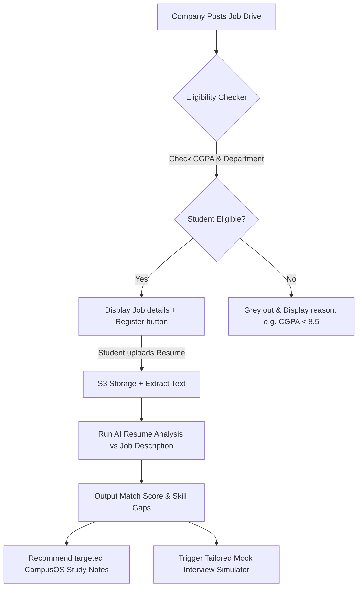

# CampusOS – Modules & Workflows Specification

This document details the operational workflows, algorithms, and logical structures governing the core and advanced modules of the CampusOS Digital Twin SaaS.

---

## 💻 Dashboard Systems & User Personas

CampusOS divides functional layouts into three secure role-specific interfaces:

### 1. Student Dashboard Portal
Designed as a personalized command center detailing live academic telemetry:
* **Academic Telemetry**: Dynamic cards displaying GPA, assignment checklist status, and class attendance dial (color coded: green > 75%, amber 65-74%, red < 65%).
* **Schedule Ticker**: Chronological timetable slots matching the student's branch, section, and semester for the active day.
* **Material Hub**: Fast-access view to recent study notes, papers, and assignments.

### 2. Faculty Command Console
Empowers professors to manage academic delivery and logistics:
* **Lecture Checklist**: Start lecture module to log direct attendance or launch dynamic classroom QR codes.
* **Upload Hub**: Upload syllabus notes, lecture transcripts, and assignments, specifying course mapping and publishing visibility constraints.
* **Analytics Center**: Visual dashboards highlighting student attendance risks and assignment submission metrics.

### 3. Institutional Administration Dashboard
Centralized registry management and system configuration:
* **Directory Management**: Complete CRUD operations over Students, Faculty, and Departments.
* **Billing & Tenant Controls**: Configure institution parameters, billing tiers, active modules, and branding keys.
* **Master Audits**: Actionable logs over student complaints, structural resource allocations, and safety records.

---

## 💼 Module 1: Placement & Career Hub

Bridging corporate opportunities with student capabilities through analytical automation:



### 1. The Eligibility Checker Algorithm
When a placement drive is registered, eligibility is evaluated programmatically on load:
```javascript
const evaluatePlacementEligibility = async (studentId, driveId) => {
  const student = await db.query(
    'SELECT gpa, dept_id FROM students WHERE user_id = $1', [studentId]
  );
  const drive = await db.query(
    'SELECT eligibility_min_cgpa, eligible_departments FROM placements_drives WHERE id = $2', [driveId]
  );
  
  const isCgpaValid = student.gpa >= drive.eligibility_min_cgpa;
  const isBranchValid = drive.eligible_departments.includes(student.dept_id);
  
  return {
    eligible: isCgpaValid && isBranchValid,
    reasons: {
      cgpa: isCgpaValid ? "Met" : `Requires min ${drive.eligibility_min_cgpa} (Your GPA: ${student.gpa})`,
      branch: isBranchValid ? "Met" : "Your department is not eligible for this drive"
    }
  };
};
```

### 2. AI Resume Assessment & Mock Interview Pipeline
1. **Resume Ingestion**: Extracted text from PDF is compared to the Job Description embedding using `cosine_similarity`.
2. **Mock Preparation Router**: Students can trigger `mock-interview-session` where a custom prompt retrieves the skill gap analysis and fires a dynamic chat thread asking role-specific technical questions, scoring the voice/text answers, and feeding review logs to the resume hub.

---

## 🗺️ Module 2: Smart Campus Navigation & Wayfinding

Digitalizing campus physical boundaries to guide students and locate vacant spaces:

### 1. Space Matrix System & Locator
Every room, office, lab, and corridor is mapped onto an institutional 2D floor grid. We track coordinate points `{ x, y }` on building blueprints.
* **Dynamic Finder**: Query physical locations matching `location_type = 'laboratory'` or `'classroom'` where `is_currently_free = true`.
* **QR Wayfinding**: Scanning physical QR codes placed inside campus corridors (e.g., coordinates `Building B, Floor 2, Corridor 3`) loads the map interface automatically setting the student's "Start Point" and routing path arrows to their desired classroom or faculty office.

### 2. Route Pathfinding Logic (Simplified A* Search)
CampusOS maps building nodes into a standard pathfind graph. The frontend draws SVG vectors outlining the path on the campus blueprint:
```javascript
// Dynamic pathfinding routing calculation
const generateInsidePath = (startNodeId, targetNodeId, floorGraph) => {
  // Executes A* Search algorithm calculating the shortest path over corridors and stairs
  const path = aStarSearch(floorGraph, startNodeId, targetNodeId);
  return path.map(node => ({ x: node.x, y: node.y, floor: node.floor }));
};
```

---

## 📚 Module 3: AI Study Companion

Empowering student performance through personalized generative study agents:

```
[ Uploaded notes / PDF ] ──► [ Generate Vector Chunks ]
                                    │
         ┌──────────────────────────┼──────────────────────────┐
         ▼                          ▼                          ▼
 [ Quiz Generator ]       [ Flashcard Generator ]    [ Viva Prep Assistant ]
 Generates 5 MCQs with     Creates term-definition    Dynamic chat agent mimicking
 explanations.             cards matching topics.     an external examiner.
```

### 1. Flashcard Generation Flow
1. The student selects an uploaded lecture slide document.
2. The UI sends a segment or page range to `POST /api/v1/companion/flashcards`.
3. The LLM extracts key terms and conceptual definitions, returning a clean array of `{ card_id, question, answer }`.
4. Cards are stored in the client state using React flip-animations to help students self-test.

### 2. Personalized Learning Assistant
1. Analyzes the student's performance logs (failed assignment questions, low quiz marks).
2. Detects weak keywords (e.g. "Deadlocks", "Indexing").
3. Connects the vector database to search notes specifically targeting those keywords and lists them on the student dashboard under the header: **"Topics requiring your attention today"**.

---

## 📊 Module 4: Predictive Analytics

Transforming basic academic tracking into actionable predictive intelligence.

### 1. Attendance Risk Engine
Every night, a CRON scheduler runs the risk calculator across enrolled students.
* **The Logic**: If the student's attendance percentage falls below 75%, they are flagged. If the remaining sessions in the semester make it mathematically impossible to reach 75% even with full attendance, the risk level escalates to "CRITICAL".
* **Alert Trigger**: Automatic notification dispatched to Student, Faculty Advisor, and Parents.

$$\text{Predicted Attendance Ratio} = \frac{\text{Classes Attended} + \text{Remaining Lectures}}{\text{Total Scheduled Lectures}}$$

### 2. Performance Prediction Model
Synthesizes test results, assignment deadlines, and quiz metrics using weighted averages:
```javascript
const calculatePerformancePrediction = (studentMetrics) => {
  const W_ASSIGNMENTS = 0.30;
  const W_QUIZZES = 0.20;
  const W_MIDTERMS = 0.50;
  
  const predictedScore = 
    (studentMetrics.assignmentsAvg * W_ASSIGNMENTS) +
    (studentMetrics.quizzesAvg * W_QUIZZES) +
    (studentMetrics.midtermsAvg * W_MIDTERMS);
    
  return {
    score: predictedScore,
    classification: predictedScore >= 80 ? 'Excellent' : (predictedScore >= 60 ? 'Average' : 'At Risk')
  };
};
```

---

## 🎯 Module 5: Recommendation Engine

CampusOS coordinates a centralized Recommendation Engine (`recommendation-service`) that generates personalized action feeds:

| Recommendation Context | Input Signals | Recommendation Output |
| :--- | :--- | :--- |
| **Study Materials** | Weak quiz topics + Active Semesters | Targeted PDF chunks + Chapter notes |
| **Event Matches** | User clubs registered + Hobbies | Relevant Tech-Fest tracks / Hackathons |
| **Club Allocations** | Student skill inventory profiles | Club vacancies seeking matching skills |
| **Career Placements** | CGPA + Resume parsed skill vectors | High probability corporate drives |

---

## 🏛️ Module 6: Booking System (Classrooms, Labs & Equipment)

Preventing institutional scheduling conflicts:

1. **User Request**: Faculty/Student requests dynamic booking: Classroom B102, next Tuesday, 2 PM to 4 PM.
2. **Conflict Evaluation**: The Booking Engine executes an atomic query:
   ```sql
   SELECT EXISTS (
     SELECT 1 FROM bookings 
     WHERE resource_id = $1 
       AND status = 'approved'
       AND (start_time, end_time) OVERLAPS ($2::timestamp, $3::timestamp)
   ) AS is_conflicting;
   ```
3. **Execution**: If `is_conflicting` is false, request proceeds to database insertion. If true, booking is denied with recommendations for nearby vacant rooms of equivalent size during that time slot.

---

## 📢 Module 7: Complaint, Lost & Found, and Clubs

### 1. Complaint Escalation
Complaints are logged under categories ('facility', 'academic') and assigned to staff via round-robin. If a complaint remains "open" for more than 72 hours, it automatically escalates to a higher department administrator.

### 2. Lost & Found Matching
When a student files a "lost" report, the vector database triggers a cosine comparison against the active "found" registry. If similarity exceeds 80%, the system alerts both students and enables an exchange coordination window.
